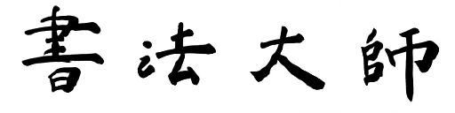

# Calligraphy Master

<p align="center">
  
</p>
<p align="center">
  
</p>

## Introduction
Calligraphy Master is an application of the popular [CycleGAN](https://github.com/junyanz/pytorch-CycleGAN-and-pix2pix) model 
to Chinese characters that transforms your handwriting to calligraphy-style font.
## Experiment Details
- **Network Structure**  
  The structure is based on the original CycleGAN model (PyTorch implementation). Check their [repository](https://github.com/junyanz/pytorch-CycleGAN-and-pix2pix) 
  or this [paper](https://arxiv.org/pdf/1703.10593.pdf) for more information.
- **Datasets**  
  The datasets consists of 5 different handwritten fonts and 5 different calligraphy fonts. Each font generates the same 3494 characters 
  of size 128x128 from the [character set](https://blog.csdn.net/u011762313/article/details/47419063) of commonly used Chinese characters. 
  The source fonts are downloaded from [字体天下](http://www.fonts.net.cn/).
- **Training Details**  
  The model is trained over 10 epochs with resnet_6blocks-generator. No preprocessing was performed to the images during training.
## Results
One thing to mention is that although the model is trained on handwritten fonts, it still provides results of good quality when tested on actual handwriting images.
#### Handwritten Fonts to Calligraphy Fonts
<p align="center">
  
  
</p>
<p align="center">
  
  
</p>
<p align="center">
  
  
</p>

#### Actual Handwriting to Calligraphy
<p align="center">
  
  
</p>
<p align="center">
  
  
</p>
<p align="center">
  
  
</p>
<p align="center">
  
  
</p>
<p align="center">
  
  
</p>

I also tried training the model with actual Chinese handwriting from [CASIA databases](http://www.nlpr.ia.ac.cn/databases/handwriting/Download.html),
but the result did not turn well. It is possibly because of the low resolution of the images, which causes the loss of clarity of the shape
of characters.
## Generate Your Own Datasets
Train your model with whatever fonts you like!  
Put font files of your choice to [handwritten-fonts](datasets/handwritten-fonts) folder and [calligraphy-fonts](datasets/calligraphy-fonts) respectively, and then you 
can generate the datasets by running
```bash
sh get_font_data.sh
```
Change the ```--img_size``` in [get_font_data.sh](datasets/get_font_data.sh) to generate images with different size.
## Pretrained Model
Pretrained model is provided [here](https://drive.google.com/drive/folders/144JQq5qp24E--jUvGx5_Pw4fp3Cf8LY9?usp=sharing). Feel free to do further training base on this pretrained model!
